# DETR: Object Detection &amp; Segmentation with DEtection TRansformer (DETR)
See https://github.com/facebookresearch/detr

## Important Notes
The paths for the trained weights and datasets are hard-coded into main.py and should be adapted.

## Example 1 (COCO)
`python main.py --img 000000117425.jpg --refpoints 625 265 300 900 200 650 447 209`

### Input Image

### Detections & Attention Weights
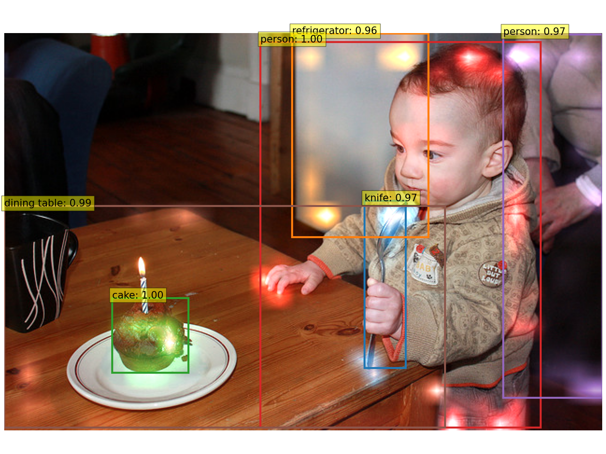

### Decoder Attention Weights for Detected Objects
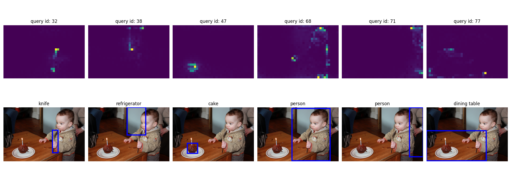

### Encoder Attention Weights for Interesting Reference Points
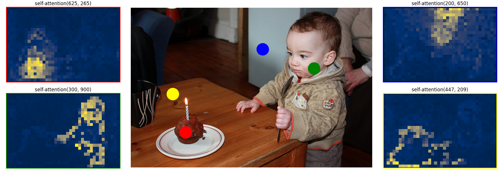

### Object Masks
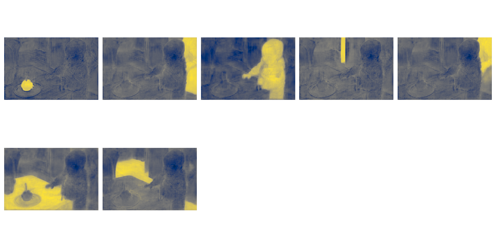

### Panoptic Segmentation
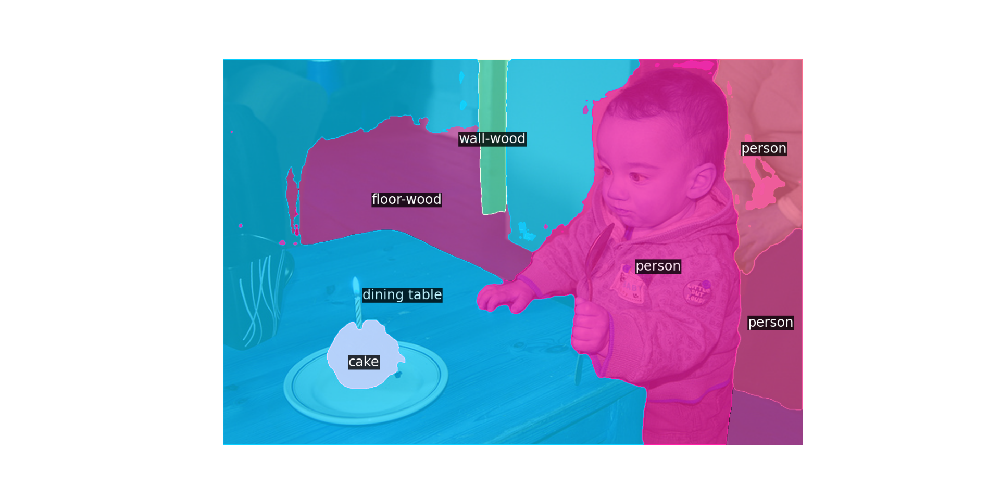

## Example 2 (Mobile Phone)
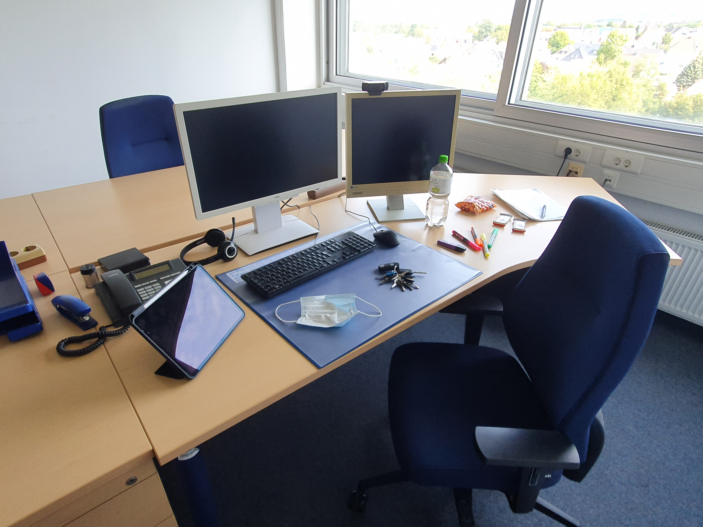

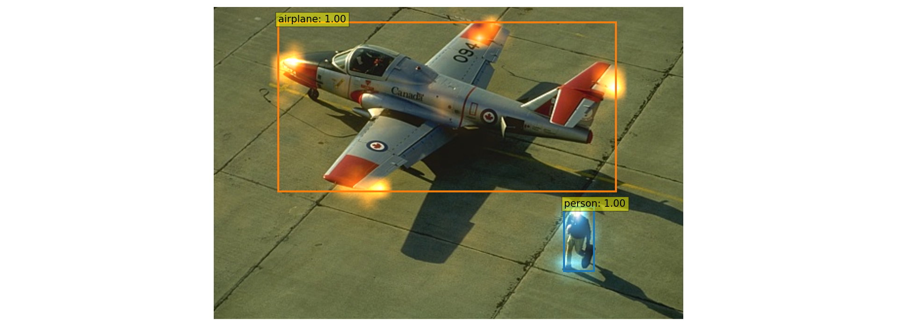

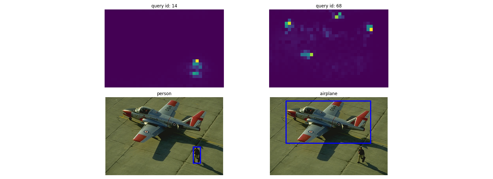

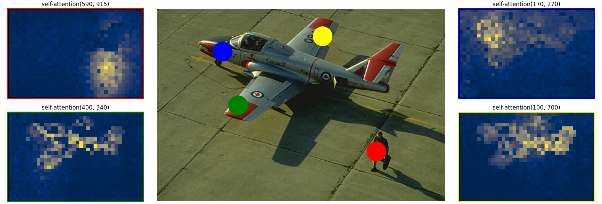

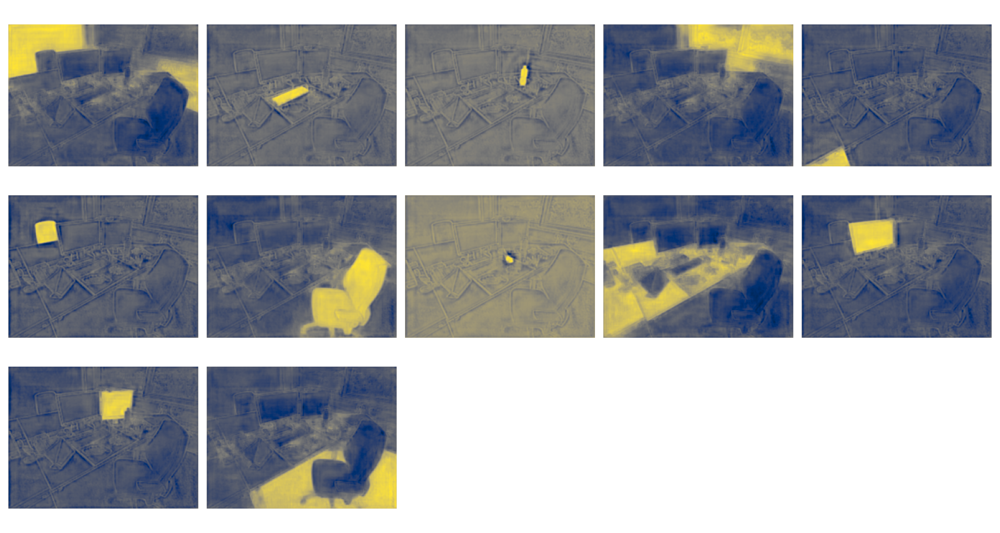

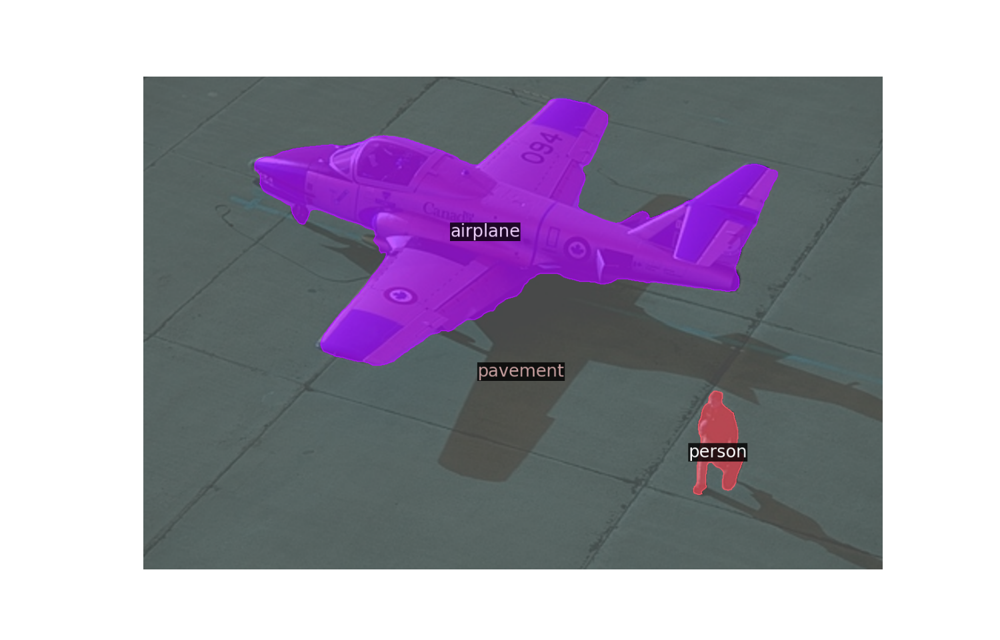
