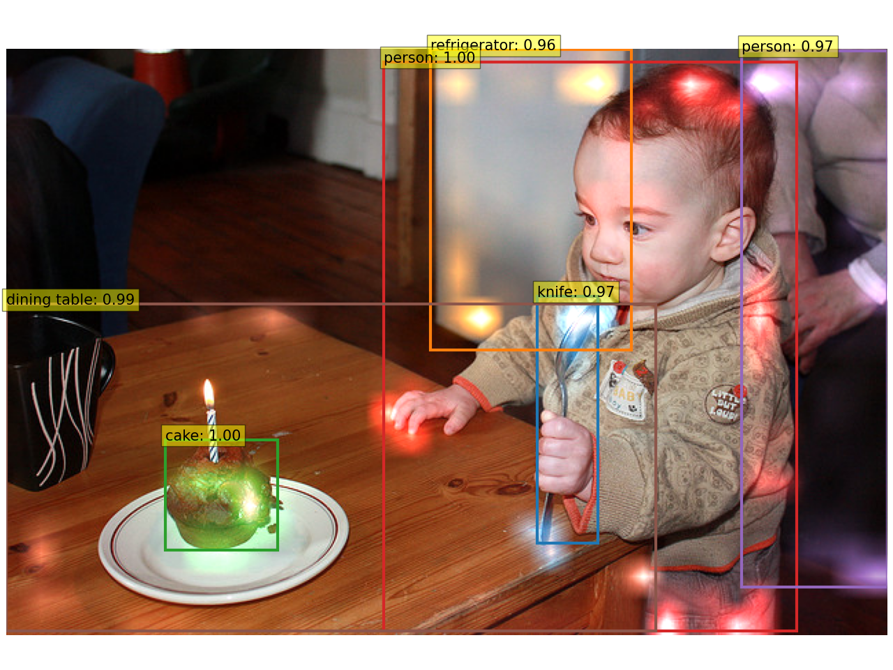
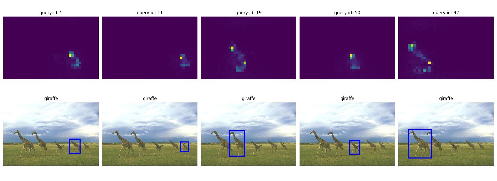
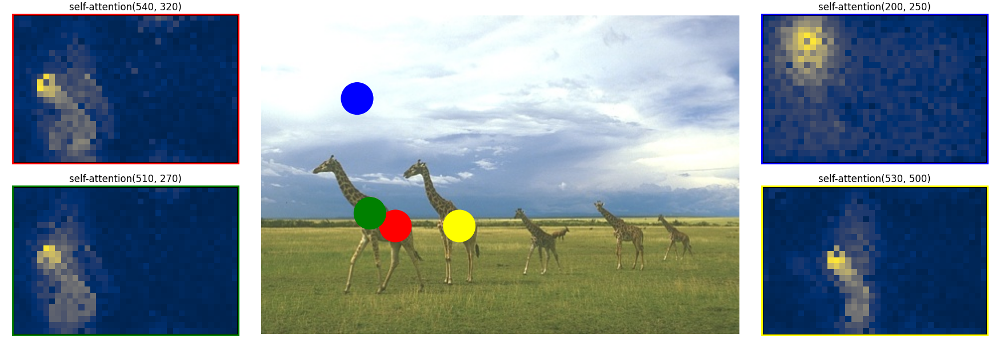
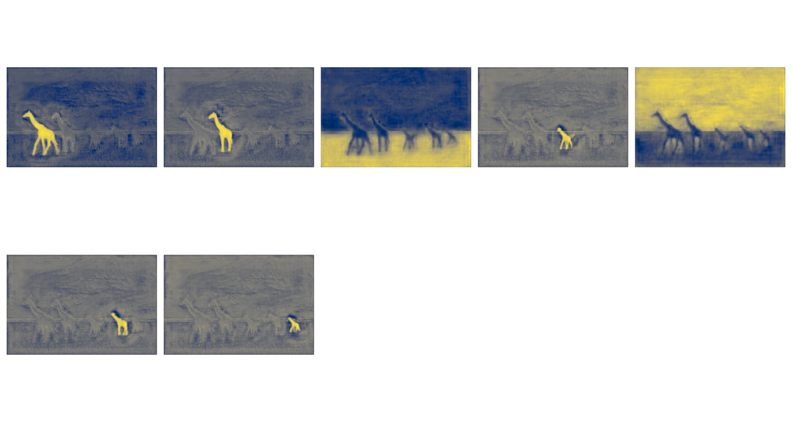
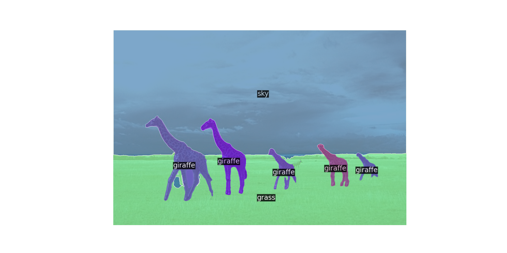

# DETR: Object Detection &amp; Segmentation with DEtection TRansformer (DETR)
See https://github.com/facebookresearch/detr

## Important Notes
The paths for the trained weights and datasets are hard-coded into main.py and should be adapted.

## Example
```
python main.py --dataset bsds --img 253055.jpg --refpoints 540 320 510 270 200 250 530 500
```
### Input Image


### Processed Outputs: Detections & Strongest Attention Weights


### Decoder Attention Weights


### Encoder Attention Weights for Interesting Reference Points


### Object Masks Generated by Attention Maps


### Panoptic Segmentation

