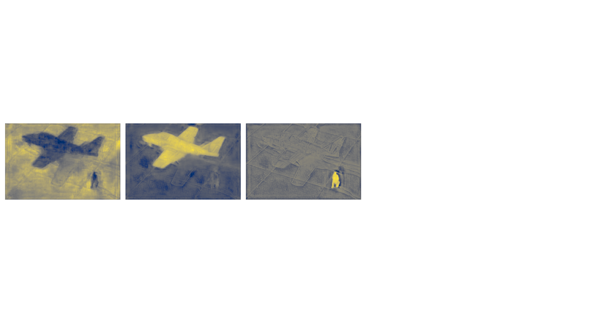

# DETR: Object Detection &amp; Segmentation with DEtection TRansformer
See https://github.com/facebookresearch/detr

## Important Notes
**The paths for the trained weights and datasets are hard-coded into main.py and should be adapted.  
Model weights and datasets are not part of this repo and can be downloaded manually.**

## Example 1 (COCO)
`python main.py --img 000000117425.jpg --refpoints 625 265 300 900 200 650 447 209`

### Input Image

### Detections & Attention Weights

### Decoder Attention Weights for Detected Objects

### Encoder Attention Weights for Interesting Reference Points

### Object Masks

### Panoptic Segmentation

## Example 2 (BSDS)
`python main.py --dataset bsds --img 37073.jpg --refpoints 590 915 400 340 170 270 100 700`

## Example 3 (Mobile Phone)

